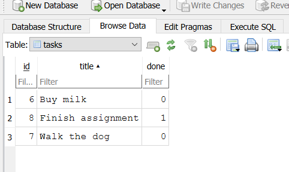
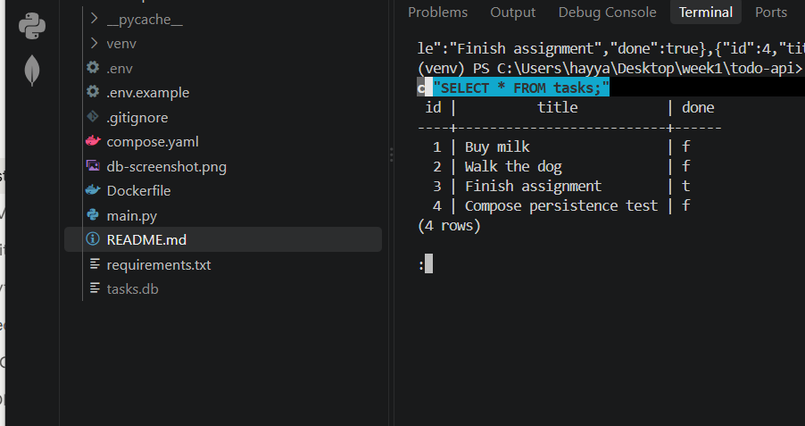
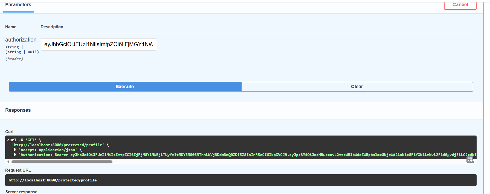

# Task API

A simple in-memory CRUD API for managing tasks, built with FastAPI as part of a backend development internship assignment.

## What this is

This API lets you create, read, update, and delete tasks. Data is stored in memory only — it resets every time the server restarts. There's no database yet; that's a deliberate first step before adding persistence.
# Task API

A CRUD API for managing tasks, built with FastAPI and backed by a SQLite database. Originally built with in-memory storage; now persists data to disk so tasks survive a server restart.

## Why SQLite

SQLite needs no separate server, no install, and no configuration — the entire database is a single file (`tasks.db`) that Python's built-in `sqlite3` module can read and write directly. That makes it a natural next step after in-memory storage: same zero-setup simplicity, but now the data survives a restart. It's a great fit for small projects and prototypes before scaling up to something like PostgreSQL.

## Where the database lives

The database is a single file, `tasks.db`, created automatically in the project root the first time the app runs. It is not committed to Git (see `.gitignore`) — each person running the project gets their own local copy, seeded with 3 example tasks the first time.

## How to run

1. Clone this repo and `cd` into it
2. Create a virtual environment: `python -m venv venv`
3. Activate it:
   - Windows: `.\venv\Scripts\Activate.ps1`
   - Mac/Linux: `source venv/bin/activate`
4. Install dependencies: `pip install fastapi uvicorn`
5. Start the server: `uvicorn main:app --reload`
   - On first run, this automatically creates `tasks.db` and seeds it with 3 example tasks
6. Visit `http://localhost:8000/docs` for interactive Swagger UI

## Endpoints

| Method | Endpoint         | Meaning                          |
|--------|------------------|-----------------------------------|
| GET    | `/`              | API info                          |
| GET    | `/health`        | Health check                      |
| GET    | `/tasks`         | List all tasks                    |
| GET    | `/tasks/{id}`    | Get a single task                 |
| POST   | `/tasks`         | Create a new task                 |
| PUT    | `/tasks/{id}`    | Update a task's title and/or done status |
| DELETE | `/tasks/{id}`    | Delete a task                     |

## Example request

```
curl -i http://localhost:8000/tasks
```

## Example SQL query

Run directly against `tasks.db` using DB Browser for SQLite:

```sql
SELECT * FROM tasks WHERE done = 1;
```

This returns only completed tasks — and the API reflects the change instantly, since both read from the same database file.

## Database viewer



## Notes

- Data now persists in `tasks.db` (SQLite) instead of a Python list — restarting the server no longer wipes your tasks.
- All queries use parameterized statements (`?` placeholders) to avoid SQL injection.
- Status codes follow REST conventions: `201` created, `200` success, `204` deleted with no content, `400` bad input, `404` not found.
- Built stage by stage with a commit after each — see commit history for the full progression from in-memory storage to SQLite.
## How to run

1. Clone this repo and `cd` into it
2. Create a virtual environment: `python -m venv venv`
3. Activate it:
   - Windows: `.\venv\Scripts\Activate.ps1`
   - Mac/Linux: `source venv/bin/activate`
4. Install dependencies: `pip install fastapi uvicorn`
5. Start the server: `uvicorn main:app --reload`
6. Visit `http://localhost:8000/docs` for interactive Swagger UI

## Endpoints

| Method | Endpoint         | Meaning                          |
|--------|------------------|-----------------------------------|
| GET    | `/`              | API info                          |
| GET    | `/health`        | Health check                      |
| GET    | `/tasks`         | List all tasks                    |
| GET    | `/tasks/{id}`    | Get a single task                 |
| POST   | `/tasks`         | Create a new task                 |
| PUT    | `/tasks/{id}`    | Update a task's title and/or done status |
| DELETE | `/tasks/{id}`    | Delete a task                     |

## Example request

```
curl -i http://localhost:8000/tasks
```
## Swagger UI


## Notes

- Built stage by stage, with a commit after each stage — see commit history for progress from "hello server" to full CRUD.
- Status codes follow REST conventions: `201` for created, `200` for success, `204` for deleted with no content, `400` for bad input, `404` for not found.
## Running Postgres (Docker)

This project now uses Postgres instead of SQLite. Start it with:

This runs Postgres 16 in a container named `taskdb`, with a named volume (`taskdata`) so data survives container restarts.
## Running with Docker (Postgres)

This project now runs Postgres in Docker, with the app itself also containerized. Everything starts with one command.

### Quick start

This builds the API image, starts Postgres, and connects them over Docker's internal network. On first run, the app creates the `tasks` table and seeds 3 example tasks.

Visit `http://localhost:8000/docs` for Swagger UI, same as before.

### Environment variables

Copy `.env.example` to `.env` and adjust if needed:

Note: inside Docker Compose, the app uses `db` as the host (the service name), not `localhost` — this is set automatically in `compose.yaml`.

### Architecture

- `api` service — the FastAPI app, built from the local `Dockerfile`
- `db` service — Postgres 16, with a named volume (`taskdata`) so data survives container restarts
- The two containers communicate over Docker's internal network; only the API port (`8000`) is exposed to your machine

### Proving persistence

Created a task, ran `docker compose down` (removes both containers), then `docker compose up` again. The task was still present in `GET /tasks` afterward — proof the named volume preserved the data even though the containers themselves were fully recreated.

### Running without Docker (local dev)

1. Start Postgres manually: `docker run --name taskdb -e POSTGRES_PASSWORD=dev -e POSTGRES_DB=tasks -p 5432:5432 -v taskdata:/var/lib/postgresql/data -d postgres:16`
2. Create a venv and install: `pip install -r requirements.txt`
3. Copy `.env.example` to `.env`
4. Run: `uvicorn main:app --reload`

## Database screenshot


## Authentication (Supabase)

This API now includes user authentication via Supabase Auth. Supabase handles password hashing and JWT signing — this server only ever receives and verifies tokens, never handling raw passwords itself.

### Setup

1. Create a free project at [supabase.com](https://supabase.com)
2. In Project Settings → API, copy your Project URL and anon/publishable key
3. In Authentication → Providers → Email, turn off "Confirm email" (for local testing only)
4. Copy `.env.example` to `.env` and fill in your values:

Or locally without Docker:

### API Reference

| Method | Endpoint                | Auth required           | Purpose                          |
|--------|--------------------------|--------------------------|-----------------------------------|
| POST   | `/auth/signup`           | None                     | Create a new user account         |
| POST   | `/auth/login`            | None                     | Authenticate, returns a JWT       |
| POST   | `/auth/logout`           | `Authorization: Bearer`  | End the current session           |
| GET    | `/public/info`           | None                     | Public, open data                 |
| GET    | `/protected/profile`     | `Authorization: Bearer`  | Get the logged-in user's profile  |
| GET    | `/protected/dashboard`   | `Authorization: Bearer`  | Another protected route (demonstrates guard reuse) |

Tasks endpoints (`/tasks`, etc.) from earlier assignments remain unauthenticated.

### Swagger UI

Visit `/docs` — protected routes show a padlock icon. Click **Authorize**, paste a JWT from `/auth/login`, and test any protected route directly from the browser.



